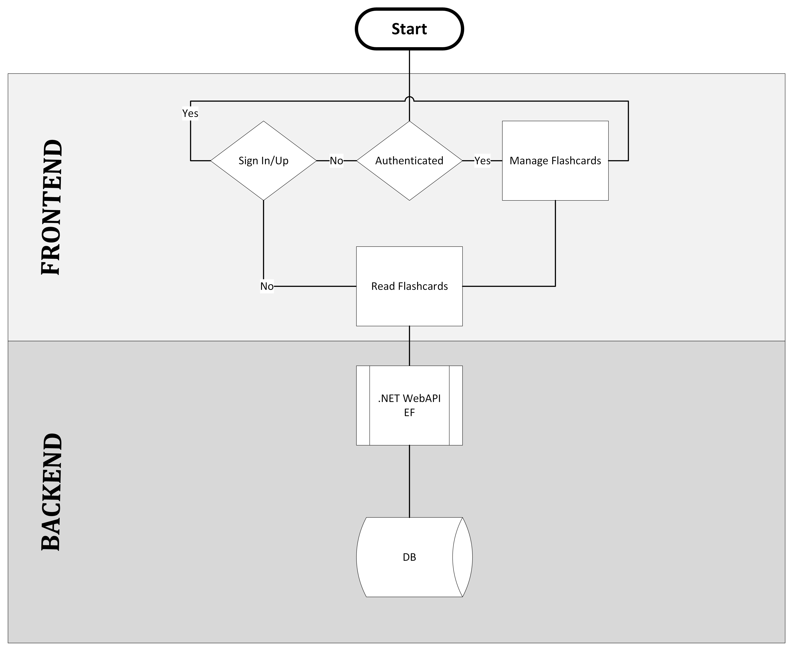

# FlashQuizzz

## Project Overview
The flashcard application is designed to help users create, manage, and take quizzes using a set of flashcards. The backend is built using ASP.NET Core with Entity Framework for data management, while the frontend is implemented using React.

## MVP Features
1. User Authentication:
    * Users will be able to create an account or log in.
    * Secure authentication mechanism to ensure user data privacy.
    * Use Microsoft identity framework.
2. Manage questions:
    * Authenticated users will allow to do CRUD on the questions.
    * Allow users to read the cards in a random order and flip them.
3. Other P3 requirements.

## ERD (Entity-Relationship Diagram)
Lorem ipsum...

## Stretch Goals
1. Have a service that randomly generates quizzes based on the flashcards.
2. Make it look nice with React.

## Conclusion
This project cover the main points in the curriculum we follow in the cohort "240708-NET-FS" of Revature.
