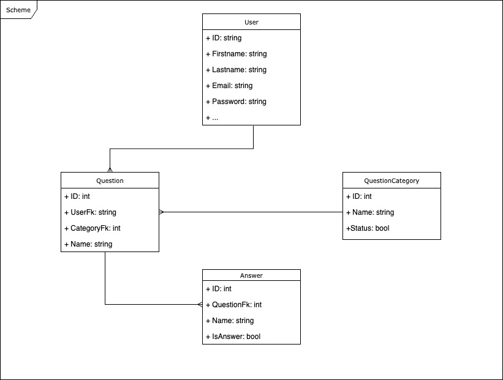

# FlashQuizzz
This is the API for the application FlashQuizzz, for which the front-end repository can be found [here](https://github.com/emmanuelalesna/FlashQuizzz/). More information about this project in general can also be found there.

This API was created following RESTful API practices, and uses .NET, ASP.NET Core, and Entity Framework to connect to a SQL Server database.

## ERD (Entity-Relationship Diagram)

The relationship between the various entities can be seen above. In short, a flash card has one category and one answer, each stored in a separate table but connected via foreign key contraints. Users are stored in another table and can own any number of flash cards. Passwords and sign-ins are managed by ASP.NET Core Identity.

The API is modelled in three distinct layers, after the Data Access Object pattern. The controllers handle initial endpoint hits, converting incoming data into a friendly format for the rest of the API. This data is then passed to the services, which check for conformity to our business logic (making sure no duplicate categories exist, making sure no negative ID requests pass through, etc.). The DAO layer directly communicates to the database, using Entity Framework in a code-first approach to minimize SQL programming.

The API provides a number of services, with the most important being the retrieval and creation of particular users based on ID or sign-in, and the CRUD operations for flash cards.

This is also hosted on Azure [here](https://flashquizzz-api-2-gqe6ckakdregf4b4.eastus2-01.azurewebsites.net/).
